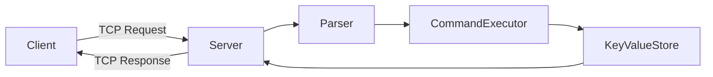

# Build Your Own Redis

A Redis-like in-memory key-value server built from scratch to understand networking, protocol parsing, and data structures.

 

 

Learning distributed systems by rebuilding the fundamentals.

---

## Table of Contents

- [About](#about)
- [Goals](#goals)
- [Features](#features)
- [Architecture](#architecture)
- [Request Lifecycle](#request-lifecycle)
- [Project Structure](#project-structure)
- [Getting Started](#getting-started)
- [Example Usage](#example-usage)
- [Tech Stack](#tech-stack)
- [Future Improvements](#future-improvements)
- [Contributing](#contributing)
- [License](#license)

---

## Architecture

High-level architecture:

---

## About

This project is a Redis-inspired in-memory database built from scratch.

Instead of using Redis directly, this implementation builds:

- A TCP server
- Command parsing logic
- In-memory key-value storage
- Basic Redis-style commands
- Request-response handling over sockets

The goal is deep systems understanding rather than using high-level abstractions.

---

## Goals

- Understand how TCP servers operate
- Implement a custom request-response protocol
- Design an efficient in-memory data structure
- Explore concurrency patterns
- Build intuition for distributed systems

---

## Features

- Custom TCP server
- Command parser
- In-memory key-value store
- Redis-like commands:
  - `SET`
  - `GET`
  - `DEL`
  - `PING`
- Modular and readable code structure

---

